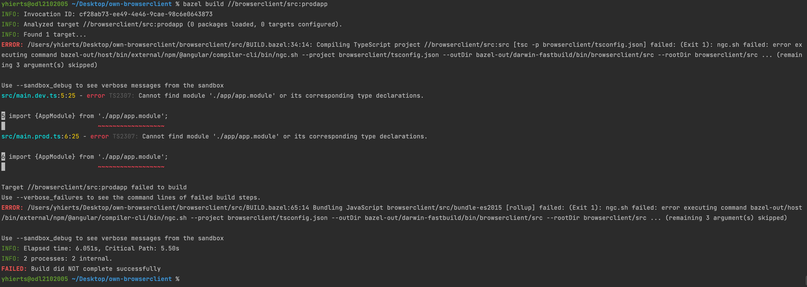

# How to run
```
bazel build //browserclient/src:prodapp
```

# Error


```typescript
INFO: Invocation ID: cf28ab73-ee49-4e46-9cae-98c6e0643873
INFO: Analyzed target //browserclient/src:prodapp (0 packages loaded, 0 targets configured).
INFO: Found 1 target...
ERROR: /Users/yhierts/Desktop/own-browserclient/browserclient/src/BUILD.bazel:34:14: Compiling TypeScript project //browserclient/src:src [tsc -p browserclient/tsconfig.json] failed: (Exit 1): ngc.sh failed: error executing command bazel-out/host/bin/external/npm/@angular/compiler-cli/bin/ngc.sh --project browserclient/tsconfig.json --outDir bazel-out/darwin-fastbuild/bin/browserclient/src --rootDir browserclient/src ... (remaining 3 argument(s) skipped)

Use --sandbox_debug to see verbose messages from the sandbox
src/main.dev.ts:5:25 - error TS2307: Cannot find module './app/app.module' or its corresponding type declarations.

5 import {AppModule} from './app/app.module';
                          ~~~~~~~~~~~~~~~~~~
src/main.prod.ts:6:25 - error TS2307: Cannot find module './app/app.module' or its corresponding type declarations.

6 import {AppModule} from './app/app.module';
                          ~~~~~~~~~~~~~~~~~~

Target //browserclient/src:prodapp failed to build
Use --verbose_failures to see the command lines of failed build steps.
ERROR: /Users/yhierts/Desktop/own-browserclient/browserclient/src/BUILD.bazel:65:14 Bundling JavaScript browserclient/src/bundle-es2015 [rollup] failed: (Exit 1): ngc.sh failed: error executing command bazel-out/host/bin/external/npm/@angular/compiler-cli/bin/ngc.sh --project browserclient/tsconfig.json --outDir bazel-out/darwin-fastbuild/bin/browserclient/src --rootDir browserclient/src ... (remaining 3 argument(s) skipped)

Use --sandbox_debug to see verbose messages from the sandbox
INFO: Elapsed time: 6.051s, Critical Path: 5.50s
INFO: 2 processes: 2 internal.
FAILED: Build did NOT complete successfully
```